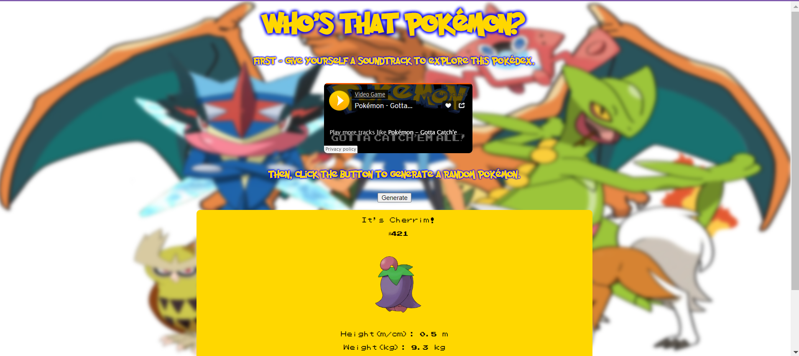

# PokéDex Clone - A Modern Pokédex

This is a Pokédex clone made with JavaScript and the [PikaServe API](https://purukitto.github.io/PikaServe/).

## Demo
[Click here](https://gemafawell-pokedex-clone.netlify.app/) to see the demo.  
  

## Screenshots

## How to use
1. Play the music by pressing the play button on the SoundCloud player.
2. Click on the 'Generate' button to start the Pokédex.
3. Click on the 'Generate' button to generate a new Pokémon.

## Credits and Resources
- [PikaServe API](https://purukitto.github.io/PikaServe/) - API used to get Pokémon data.
- [FontSpace Pocket Monk Font](https://www.fontspace.com/pocket-monk-font-f23540) - Font used for the Pokédex.
- [FontSpace Pokémon GB Font](https://www.fontspace.com/pokemon-gb-font-f9621) - Font used for the Pokédex.
- [David Andrade's DeviantArt - Ash Best Team](https://www.deviantart.com/davidbksandrade/art/Pokemon-Ash-Best-Team-697221487) - Background image used for the Pokédex.
